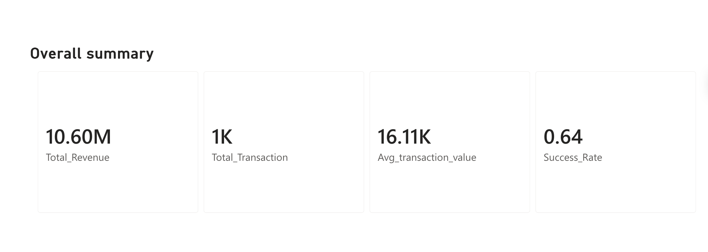

# eSewa Transaction Analysis 2024

A data analytics project exploring 1,000 eSewa transactions across Nepal in 2024 — uncovering revenue trends, customer behavior, and payment patterns using Power BI and DAX.

---

## Project Overview

eSewa is one of Nepal's leading digital payment platforms. This project analyzes a full year of transaction data (January–December 2024) to understand how Nepalis are using digital payments — where, how much, and through which channels.

---

## Tools Used

- **Power BI** — Dashboard design and visualization
- **DAX** — Data cleaning and calculated measures
- **Excel** — Raw data storage and transformation

---

## Key Metrics

| Metric | Value |
|---|---|
| Total Revenue | NPR 10.60M |
| Total Transactions | 1,000 |
| Avg Transaction Value | NPR 16,110 |
| Overall Success Rate | 64% |

---

## Dashboard Pages

### 1. Overall KPIs
High level summary of total revenue, transaction count, average transaction value, and success rate.

### 2. Revenue Overview
- Monthly revenue trend showing a decline from NPR 1M (November) to NPR 0.6M (January)
- Revenue by city — Kathmandu leads at NPR 2.5M+, followed by Pokhara
- Revenue by category — Fund Transfer dominates, followed by Remittance
- Month-over-Month (MoM) growth analysis
- Transactions split equally across Agent, Mobile App, and Web channels (33.3% each)

### 3. Customer & Transaction Analysis
- Revenue by age group — Young Adults are the highest spenders
- Transaction success analysis — 658 Completed, 192 Pending, 175 Declined
- Transactions by day of week — evenly distributed across all days
- Top 10 customers by revenue
- Transaction size distribution — Medium (43.9%), Large (40.3%), Small (15.8%)

---

## Key Findings

- **Kathmandu and Pokhara** account for the majority of total revenue
- **Fund Transfer** is the most used eSewa service by revenue
- **Young Adults** are the most active demographic on the platform
- Revenue shows a **declining trend** throughout 2024 — worth investigating further
- All three channels (Agent, Mobile, Web) are used **equally**, showing diverse access patterns

---

## Files in this Repo

| File | Description |
|---|---|
| `eSewa_Analysis.pbix` | Power BI dashboard file |
| `Transformed_data.xlsx` | Cleaned dataset used for analysis |
| `screenshots/` | Dashboard screenshots |

---

## About

Made by [Swikriti Paudel](https://github.com/swikritiipaudel) 
